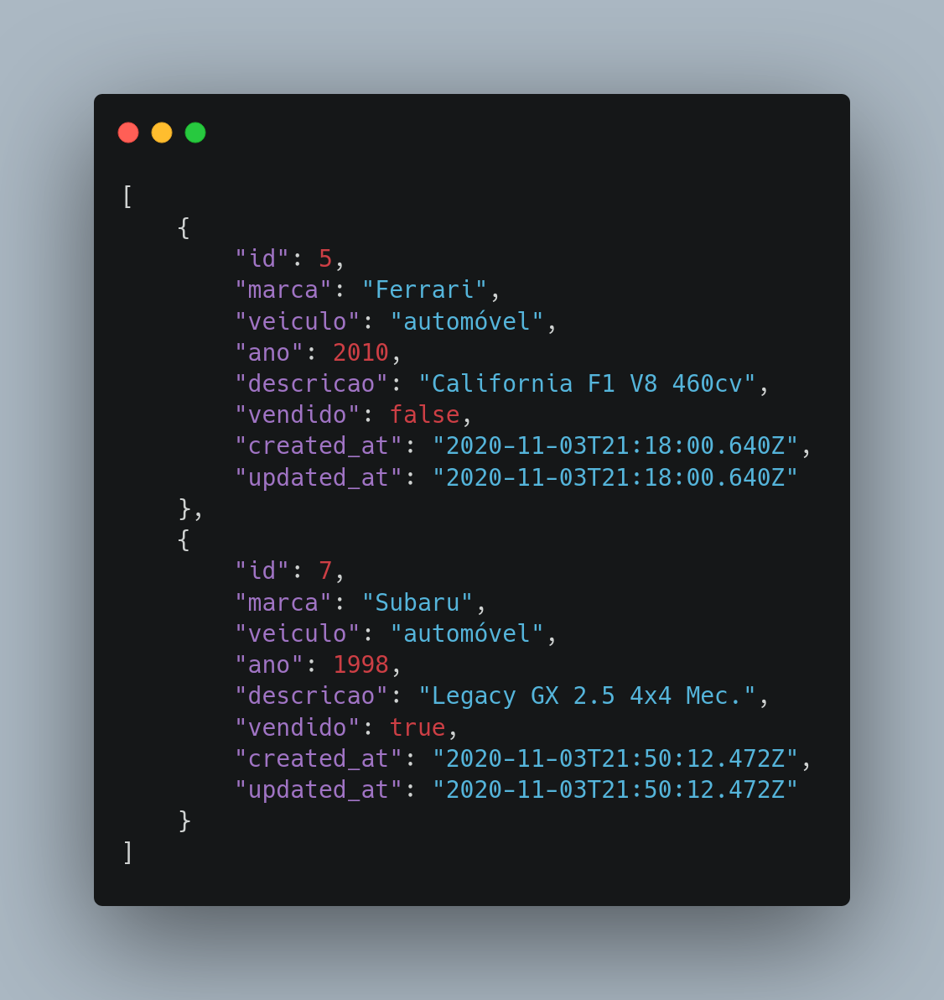
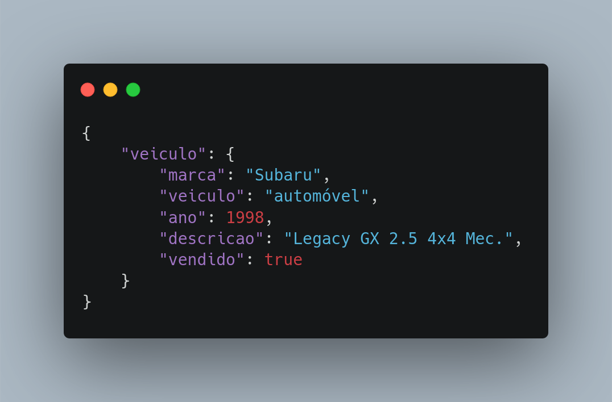
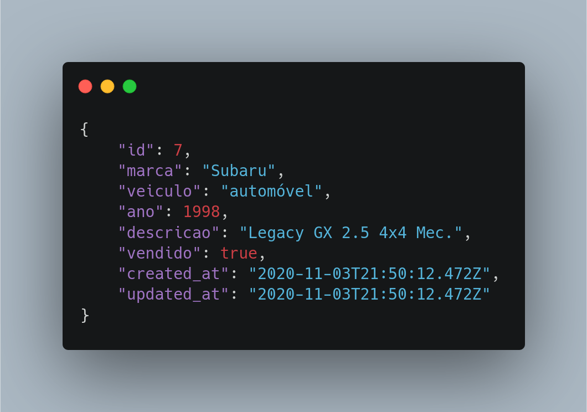
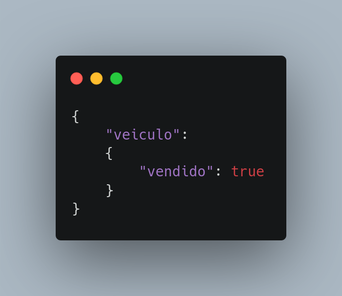
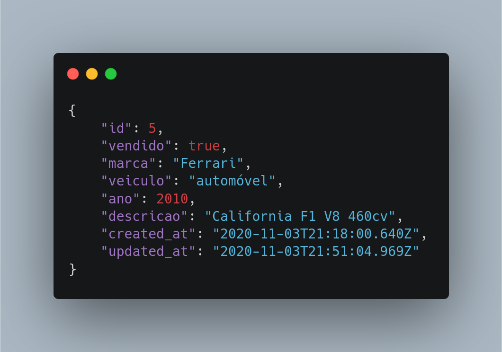
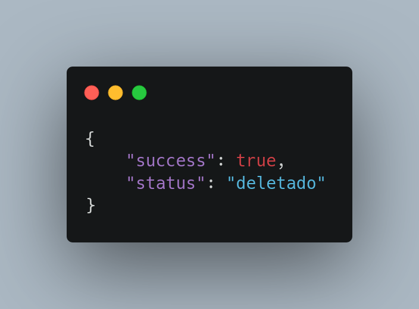

# README

## CRUD API

- Linguagem: Ruby
- Framework: Ruby on Rails
- Banco de dados: PostgresSQL

- ### rota: get /api/v1/veiculos

- ### rota: get /api/v1/veiculos/5

- ### rota: post /api/v1/veiculos

- ### rota: put /api/v1/5

- ### rota: delete /api/v1/5

